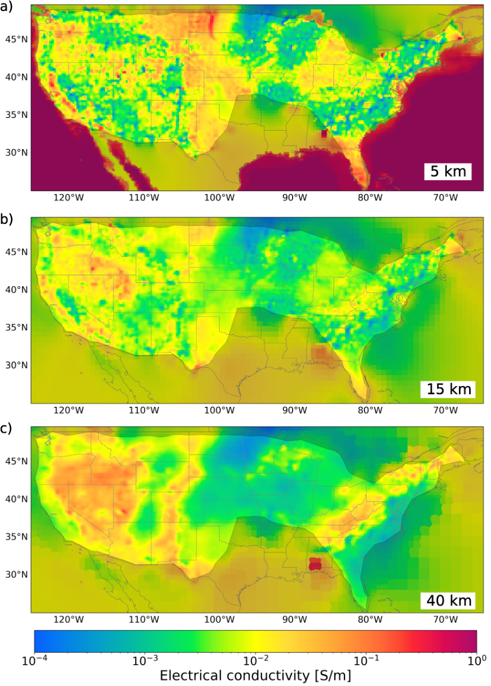

# MECMUS
Tools to read and visualize Multi-scale Electrical Conductivity Model of US (MECMUS)

The Multi-scale Electrical Conductivity Model of the United States (MECMUS-2022) was derived by inverting the full MT impedance tensor from 1291 USArray stations. The inversion procedure is described in the reference below. The Jupyter notebook can be used to read in and plot the model.

# Reference
Munch, F. and Grayver, A. V., (2023). Multi-scale imaging of 3-D electrical conductivity structure under the contiguous US constrains lateral variations in the upper mantle water content, Earth and Planetary Science Letters. https://doi.org/10.1016/j.epsl.2022.117939
