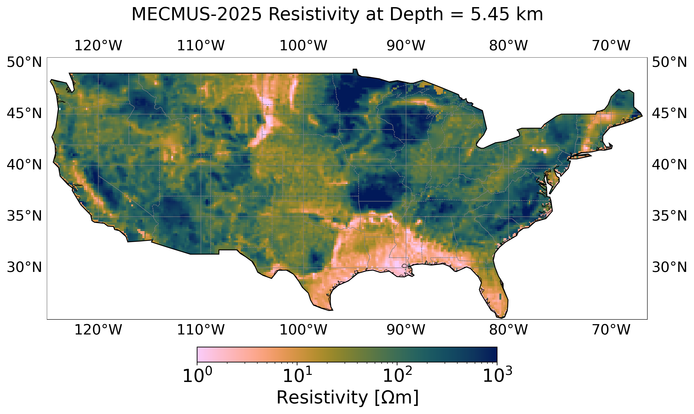
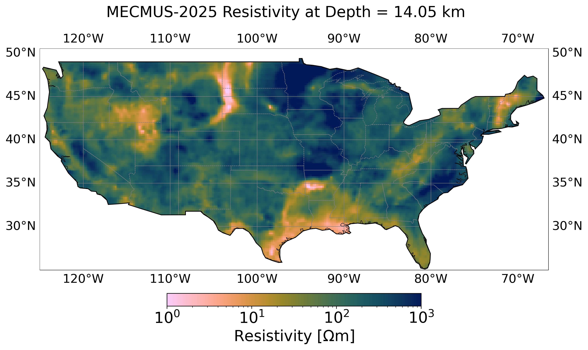
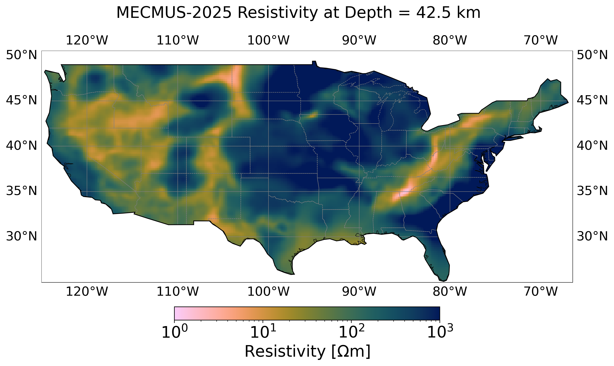
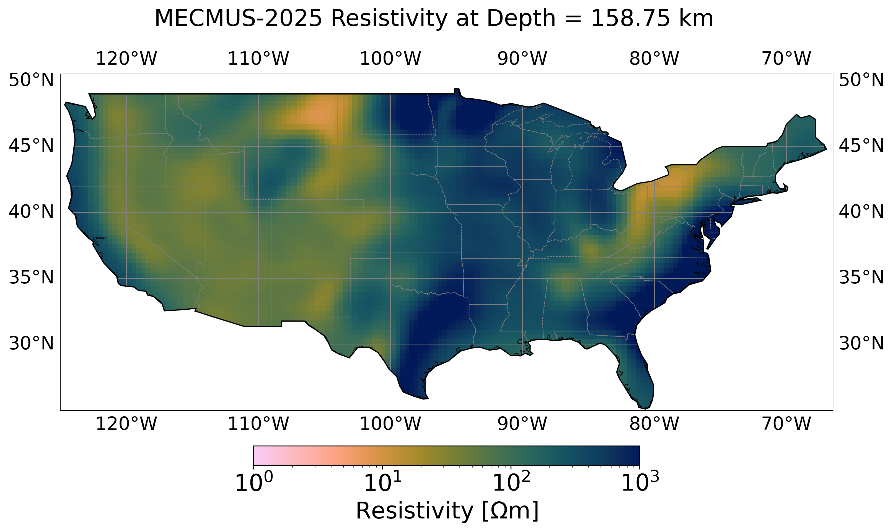

# MECMUS

Multi-scale Electrical Conductivity Model of continental US (MECMUS). The Jupyter notebook can be used to read in and plot models.

There are now two versions of the MECMUS model:
- The MECMUS-2025 is the newest version of the model, derived from nearly 1600 MT stations of the complete USArray, whereby both impedance tensor and induction vectors (tippers) were inverted in 3-D using the GoFEM inverse solver [[1](https://doi.org/10.1093/gji/ggz030), [2](https://doi.org/10.1093/gji/ggv165)]. 
- The MECMUS-2022 was derived by inverting the full MT impedance tensor from 1291 USArray stations. The inversion procedure is described in the reference below. This is the previous version of the model.

In both cases, MT data was retrieved from the IRIS data portal: https://ds.iris.edu/spud/emtf

# References
- Munch, F. and Grayver, A., (2025). Multi-scale electrical conductivity structure beneath the contiguous US, in preparation
- Munch, F. and Grayver, A., (2023). Multi-scale imaging of 3-D electrical conductivity structure under the contiguous US constrains lateral variations in the upper mantle water content, Earth and Planetary Science Letters. https://doi.org/10.1016/j.epsl.2022.117939

# License

This repository and MECMUS model are licensed under the [Creative Commons Attribution 4.0 International License (CC BY 4.0)](https://creativecommons.org/licenses/by/4.0/).